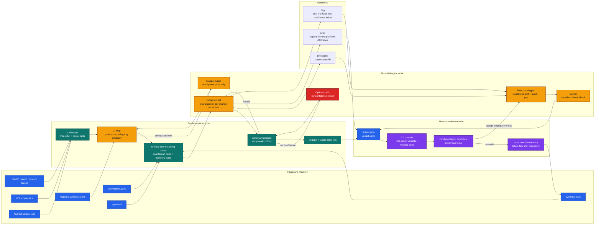
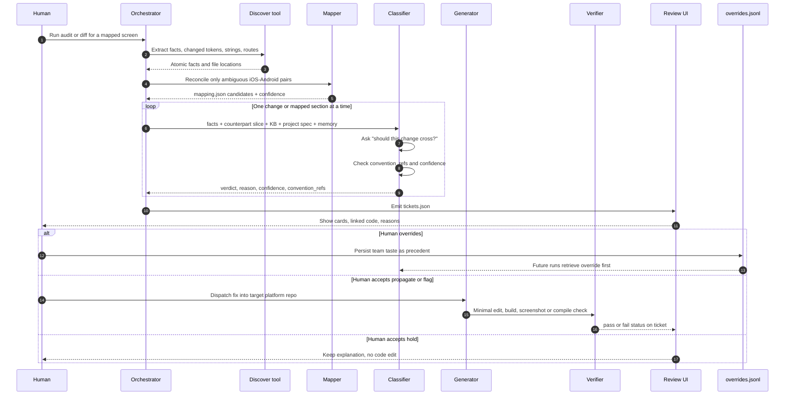
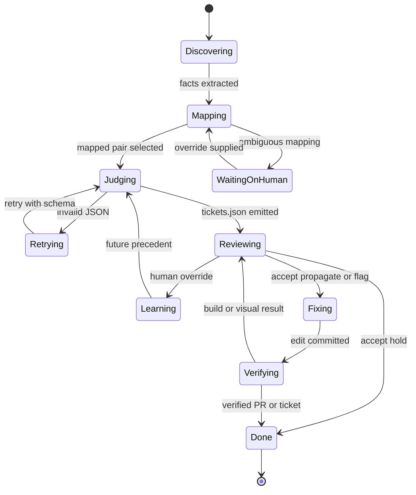

# 09 — Live Flow Side Doc

Use this as the side document while running or presenting Unitem. It shows the
pipeline, where agents talk to each other, where lag can appear, and where a
human can steer focus without breaking the core `propagate | hold | flag`
contract.

## Whole project flow

Legend:

- Green: deterministic and usually fast.
- Amber: watch for lag because it can fan out, wait on a model, build, or emulator.
- Red: intentional slowdown; only use when confidence is low or a live run is risky.
- Purple: human steering and memory updates.
- Blue: data contracts and context sources.

## Agent conversation map

## Lag and focus watch points

| Watch point | Why it can lag | What to listen for | Human focus move |
|---|---|---|---|
| `Map` | Similar paths/routes can be ambiguous across platforms. | "Which screen pair am I judging?" | Point the run at one mapped screen, or add `mapping.overrides.yaml`. |
| `Judge fan-out` | One classifier runs per atomic change or section. | "Which rule IDs support this verdict?" | Narrow to one change, cap concurrency, or ask for only low-confidence tickets. |
| `Schema validation` | Invalid agent JSON triggers retries. | "Did the response match `tickets.json`?" | Re-run with the exact schema and ask for JSON only. |
| `Critic` | A second opinion intentionally adds model latency. | "Is this a risky propagation?" | Enable only for low confidence or demo-critical tickets. |
| `Fixer cloud agent` | It edits another repo and waits for build/test loops. | "Which file changed and did it compile?" | Scope the fix to the mapped screen pair and request a minimal diff. |
| `Verifier` | Simulator/emulator or build setup can dominate runtime. | "Did the target platform actually render or build?" | Use mock runner or pre-captured screenshots when live devices are unavailable. |
| `Review UI` | Human review is where the system learns taste. | "Was the verdict accepted or overridden?" | Capture the reason in `overrides.jsonl` so the next run obeys it. |

## Focus feature prompts

Copy one of these when directing agents during a live run:

- **Narrow the room:** "Focus only on Login and only on the current atomic change;
  retrieve the counterpart slice and matching convention rules, not the whole repo."
- **Listen for rules:** "Before deciding, name the `convention_refs` you are using
  and say whether this is propagate, hold, or flag."
- **Expose lag:** "Report which stage is waiting: map, judge, schema retry, fixer,
  verifier, or human review."
- **Protect the demo:** "If confidence is low, return flag with low confidence and
  stop before generating code."
- **Use memory:** "Check `overrides.jsonl` first; if a human already decided a
  similar case, follow that precedent unless the current facts differ."

## Live run status overlay

Use this compact diagram beside terminal logs to mark the active stage.

## Side-doc usage

1. Keep this file open next to terminal output and the `/UI` console.
2. Mark the active stage from the status overlay while a run is live.
3. When a stage lags, use the matching row in "Lag and focus watch points."
4. When an agent answer feels vague, ask for the exact verdict, confidence,
   `convention_refs`, and the small code slice it used.
