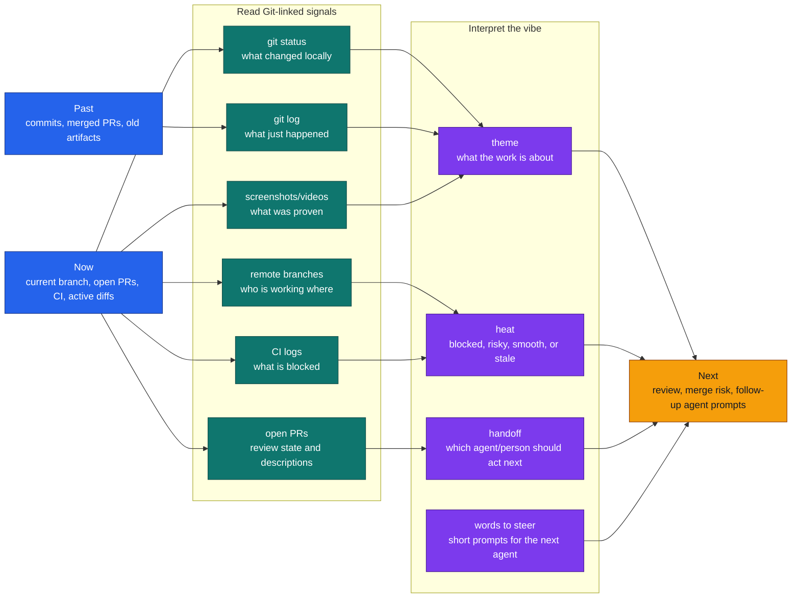
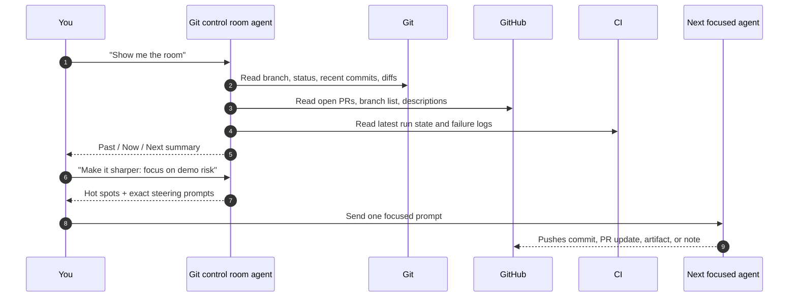

# 10 — Git Agent Control Room

This is the non-UI workflow for watching the team/agent motion around Unitem.
Use it when you want the "vibe" of what agents are doing, what changed before,
what is happening now, and what should happen next, without adding another
dashboard element to the product UI.

## What this can actually see

The control room reads signals that are linked to Git:

- local branch, commits, staged files, and uncommitted diffs
- remote branches and PRs
- CI run status and logs
- docs, screenshots, videos, and PR descriptions
- agent notes that were committed, pushed, or attached to PRs

It does not see private chat, private browser tabs, or other teammates' live
machines unless that work has been pushed, committed, or linked.

## Past → now → next flow

## Agent room narrative

## Operating script

Ask for one of these:

- **"Show me the room."** Summarize current branches, PRs, recent commits, and
  what each stream appears to be trying to do.
- **"Give me past, now, next."** Explain what changed before, what is live now,
  and the highest-leverage next move.
- **"Where is the lag?"** Identify stale branches, failing CI, missing artifacts,
  PRs without review, or work that is not linked to Git.
- **"Give me words to steer it."** Produce short prompts for the next agent or
  teammate, each tied to a branch/PR/file.
- **"Make it demo-safe."** Call out what must be proven with screenshots, video,
  build output, or schema validation before presenting.

## Output format

Use this shape so the summary stays manageable:

| Section | Meaning |
|---|---|
| `Room read` | One paragraph: overall vibe and what is visibly moving. |
| `Past` | Last meaningful commits/PRs and what they changed. |
| `Now` | Open branches/PRs, local diffs, CI, artifacts, blockers. |
| `Next` | Three concrete moves, each with an owner or agent type. |
| `Words to steer` | Copy-paste prompts that direct the next agent. |
| `Proof needed` | Tests or artifacts needed before trusting the work. |

## Steering examples

- "Focus on PR 8 only. Tell me what changed, what proof exists, and what is
  still demo-risky."
- "Ignore UI polish. Find the blocked branch or CI failure that prevents the
  next demo run."
- "Turn the last three commits into a before/after story for a teammate who has
  not seen the repo today."
- "Write one prompt for a verifier agent and one prompt for a docs agent. Keep
  both tied to the current branch."
- "If a claim is not backed by Git, CI, or an artifact, label it as unproven."
